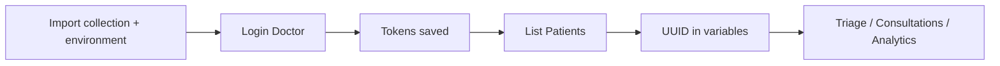

# MHTMS API Documentation & Postman Testing Guide

**Base URL (local):** `http://127.0.0.1:8000`  
**Base URL (production):** your Render app URL  
**API prefix:** `/api/v1/`

| Resource | Link |
|----------|------|
| **Postman collection** | [`postman/MHTMS_API.postman_collection.json`](postman/MHTMS_API.postman_collection.json) |
| **Postman environment (local)** | [`postman/MHTMS_API.postman_environment.json`](postman/MHTMS_API.postman_environment.json) |
| **Postman environment (production)** | [`postman/MHTMS_API_Production.postman_environment.json`](postman/MHTMS_API_Production.postman_environment.json) |
| **Swagger UI** | `{base_url}/api/docs/` |
| **OpenAPI schema** | `{base_url}/api/schema/` |

---

## Import into Postman

1. Open **Postman** → **Import** → drag or select:
   - `docs/postman/MHTMS_API.postman_collection.json`
   - `docs/postman/MHTMS_API.postman_environment.json`
2. Select environment **MHTMS — Local** in the top-right dropdown.
3. Run **Auth → Login (Doctor)** — `access_token` and `refresh_token` are saved automatically.
4. Run **Patients → List Patients** — `patient_id` is set from the first result.
5. Other requests use `{{access_token}}` via collection Bearer auth.



---

## Authentication (JWT)

| Method | Endpoint | Auth | Description |
|--------|----------|------|-------------|
| POST | `/api/v1/auth/login/` | None | Email + password → `access`, `refresh` |
| POST | `/api/v1/auth/refresh/` | None | Body: `{"refresh": "..."}` → new `access` |
| GET | `/api/v1/auth/profile/` | Bearer | Current user profile |
| POST | `/api/v1/auth/logout/` | Bearer | Optional body: `{"refresh": "..."}` to blacklist |

### Login request

```http
POST /api/v1/auth/login/
Content-Type: application/json

{
  "email": "doctor@mhtms.gov.ph",
  "password": "DemoPass123!"
}
```

### Login response (200)

```json
{
  "access": "<jwt-access-token>",
  "refresh": "<jwt-refresh-token>"
}
```

### Authenticated requests

```http
Authorization: Bearer <access_token>
```

### Lockout

After **5** failed logins, the account is locked for **10 minutes** (django-axes). Login returns validation error with `code: "locked_out"`. Correct password **still fails** while locked.

### Demo accounts (`python manage.py seed_demo`)

| Email | Role | Password |
|-------|------|----------|
| admin@mhtms.gov.ph | Super Admin | DemoPass123! |
| doctor@mhtms.gov.ph | Doctor (Carigara) | DemoPass123! |
| doctor2@mhtms.gov.ph | Doctor (Barugo) | DemoPass123! |
| nurse@mhtms.gov.ph | Nurse | DemoPass123! |
| reception@mhtms.gov.ph | Receptionist | DemoPass123! |

---

## Role-based access (summary)

| Endpoint group | Super Admin | Doctor | Nurse | Receptionist |
|----------------|:-----------:|:------:|:-----:|:------------:|
| Auth profile | Yes | Yes | Yes | Yes |
| Patients list/detail | All / clinic | Assigned only | Clinic | Clinic |
| Patient create/update | Yes | No | Yes | Yes |
| Patient queue | Yes | Yes | Yes | No |
| Triage | Yes | No | Yes | No |
| Consultations | Yes | Assigned | No | **403** |
| Analytics clinic | Yes | Yes | Yes | Yes |
| Public masked stats | Yes (no auth) | Yes (no auth) | Yes (no auth) | Yes (no auth) |

**Anti-IDOR:** Accessing another user's patient UUID returns **403** or **404** (no enumeration).

---

## Patients

| Method | Endpoint | Roles | Notes |
|--------|----------|-------|-------|
| GET | `/api/v1/patients/` | Authenticated | Scoped queryset; `?search=`, `?ordering=`, `?gender=` |
| POST | `/api/v1/patients/` | Reception, Nurse, Admin | Creates in user's clinic |
| GET | `/api/v1/patients/{uuid}/` | Authenticated | Anti-IDOR check |
| PATCH | `/api/v1/patients/{uuid}/` | Reception, Nurse, Admin | Partial update |
| PUT | `/api/v1/patients/{uuid}/` | Reception, Nurse, Admin | Full update |
| DELETE | `/api/v1/patients/{uuid}/` | Authenticated | Archives patient |
| GET | `/api/v1/patients/queue/` | Clinical staff | Active triage queue |

### Create patient body

```json
{
  "first_name": "Maria",
  "middle_name": "",
  "last_name": "Santos",
  "birth_date": "1992-06-15",
  "gender": "female",
  "address": "Carigara, Leyte",
  "contact_number": "+639171234567",
  "emergency_contact": "Juan Santos"
}
```

### Patient response fields

`id`, `patient_number`, `first_name`, `middle_name`, `last_name`, `birth_date`, `gender`, `address`, `contact_number`, `emergency_contact`, `clinic`, `created_at`

---

## Triage

| Method | Endpoint | Roles | Notes |
|--------|----------|-------|-------|
| GET | `/api/v1/triage/` | Nurse, Admin | `?severity_level=`, `?triage_status=` |
| POST | `/api/v1/triage/` | Nurse, Admin | Requires `patient` UUID |
| GET | `/api/v1/triage/{uuid}/` | Nurse, Admin | |
| PATCH | `/api/v1/triage/{uuid}/` | Nurse, Admin | Vitals / severity update |

### Create triage body

```json
{
  "patient": "<patient-uuid>",
  "blood_pressure": "140/90",
  "heart_rate": 88,
  "respiratory_rate": 18,
  "oxygen_saturation": "96",
  "body_temperature": "37.8",
  "symptoms": "Fever, cough"
}
```

Read-only on create: `severity_level`, `priority_score` (computed by triage engine).

---

## Consultations

| Method | Endpoint | Roles | Notes |
|--------|----------|-------|-------|
| GET | `/api/v1/consultations/` | Doctor, Admin | Scoped to assignments |
| POST | `/api/v1/consultations/` | Doctor, Admin | |
| GET | `/api/v1/consultations/{uuid}/` | Doctor, Admin | |
| PATCH | `/api/v1/consultations/{uuid}/` | Doctor, Admin | |
| POST | `/api/v1/consultations/{uuid}/admit/` | Doctor | Admit patient |
| POST | `/api/v1/consultations/{uuid}/discharge/` | Doctor | Discharge one |
| POST | `/api/v1/consultations/bulk-discharge/` | Doctor | Up to 100 UUIDs |

### Create consultation body

```json
{
  "patient": "<patient-uuid>",
  "diagnosis": "Acute viral URI",
  "treatment": "Rest, fluids",
  "prescription": "Paracetamol 500mg PO q6h",
  "consultation_notes": "Follow up in 3 days"
}
```

### Bulk discharge body

```json
{
  "consultation_ids": [
    "<consultation-uuid-1>",
    "<consultation-uuid-2>"
  ]
}
```

### Bulk discharge response

```json
{
  "success": true,
  "message": "Bulk discharge completed: 2 succeeded.",
  "results": {
    "success": ["<uuid>"],
    "failed": []
  }
}
```

---

## Analytics

| Method | Endpoint | Auth | Description |
|--------|----------|------|-------------|
| GET | `/api/v1/analytics/clinic/?clinic_id=` | Bearer | Clinic stats (default: user's clinic) |
| GET | `/api/v1/analytics/health-stats/?region=` | Bearer | **Masked vs unmasked twist** (by role) |
| GET | `/api/v1/analytics/regional/?region=` | None | Regional aggregates (counts only) |
| GET | `/api/v1/analytics/severity/` | Bearer | Severity distribution |
| GET | `/api/v1/analytics/trends/` | Bearer | Patient trends |

### Clinic statistics example response

```json
{
  "clinic_id": "<uuid>",
  "total_patients": 42,
  "active_triage": 8,
  "critical_cases": 2,
  "admitted_patients": 3,
  "severity_distribution": [
    {"severity_level": "critical", "count": 2},
    {"severity_level": "moderate", "count": 4}
  ]
}
```

---

## Masked vs unmasked data twist (defense demo)

Same JSON schema, different values depending on **who** calls the API.

| Caller | Endpoint | `data_classification` | PHI fields |
|--------|----------|----------------------|------------|
| **No auth** | `GET /api/v1/public/health-stats/` | `public_masked` | `HIPAA Restricted` |
| **API Consumer** JWT | `GET /api/v1/analytics/health-stats/` | `public_masked` | `HIPAA Restricted` |
| **Doctor / Nurse / Admin** JWT | `GET /api/v1/analytics/health-stats/` | `clinical_full` | Real sample patient from DB |

### Postman flow (Member 2)

1. **Login (Doctor)** → `GET /api/v1/analytics/health-stats/?region=Region VIII`  
   → `patient_name`: e.g. `"Maria Santos"`, `sample_cases`: `[{...}]`
2. **Login** as `api@mhtms.gov.ph` / `DemoPass123!` → same URL  
   → `patient_name`: `"HIPAA Restricted"`, `sample_cases`: `[]`
3. **Masked Health Stats** (no auth) → same masked shape as API Consumer

### Unmasked example (`clinical_full`)

```json
{
  "region": "Region VIII",
  "clinic_count": 3,
  "active_cases": 12,
  "data_classification": "clinical_full",
  "patient_name": "Juan Dela Cruz",
  "patient_details": "Male, 34y, Cebu City",
  "diagnosis": "Acute viral URI",
  "contact_number": "+639171234567",
  "address": "Cebu",
  "sample_cases": [
    {
      "patient_name": "Juan Dela Cruz",
      "severity_level": "critical",
      "symptoms": "Chest pain"
    }
  ]
}
```

---

## Public API (masked / HIPAA-safe)

| Method | Endpoint | Auth | Description |
|--------|----------|------|-------------|
| GET | `/api/v1/public/health-stats/?region=` | **None** | Aggregates only; PHI masked |

### Example response

```json
{
  "region": "Region VIII",
  "clinic_count": 3,
  "active_cases": 12,
  "respiratory_cases": 4,
  "top_symptoms": ["Fever", "Cough", "Headache"],
  "data_classification": "public_masked",
  "patient_name": "HIPAA Restricted",
  "patient_details": "HIPAA Restricted",
  "diagnosis": "HIPAA Restricted",
  "contact_number": "HIPAA Restricted",
  "address": "HIPAA Restricted",
  "sample_cases": []
}
```

Alias of the masked branch of `/api/v1/analytics/health-stats/` (no JWT required).

---

## HTTP status codes

| Code | Meaning |
|------|---------|
| 200 | OK |
| 201 | Created |
| 204 | No content (delete/archive) |
| 400 | Validation error |
| 401 | Missing/invalid JWT |
| 403 | Forbidden (role or Anti-IDOR) |
| 404 | Not found (or hidden for IDOR) |
| 429 | Login lockout (axes) |

### Error body (typical)

```json
{
  "detail": "You do not have permission to perform this action."
}
```

---

## Postman collection folders

| Folder | Purpose |
|--------|---------|
| **Auth** | Login, refresh, profile, logout (auto-saves tokens) |
| **Patients** | CRUD + queue (auto-saves `patient_id`) |
| **Triage** | Nurse triage workflow |
| **Consultations** | Doctor consult, admit, discharge, bulk |
| **Analytics** | Clinic and regional stats |
| **Public (Masked)** | Unauthenticated masked API |
| **Defense Demos** | Suggested capstone presentation order |

---

## Local testing checklist

```bash
python manage.py migrate
python manage.py seed_demo
python manage.py runserver
```

1. Import Postman files from `docs/postman/`.
2. **Login (Doctor)** → verify `access_token` is set.
3. **List Patients** → verify `patient_id` is set.
4. **Create Triage** (switch to **Login (Nurse)** first).
5. **Create Consultation** → **Admit** → **Bulk Discharge**.
6. **Masked Health Stats** without Authorization header.
7. **IDOR test** — paste another clinic's patient UUID → expect 403/404.

---

## Automated API tests

```bash
pytest tests/test_api_security.py -v
```

Covers Anti-IDOR, public masking, and JWT login.

---

*MHTMS API v1 — align with OpenAPI at `/api/schema/` for machine-readable spec.*
