# MHTMS Team Roles, Architecture & Security

**Municipal Health & Triage Management System (MHTMS)** — defense presentation guide with visual diagrams and file references.

| Document purpose | Audience |
|------------------|----------|
| Map each team member’s dev work to the codebase | Capstone / thesis defense panel |
| Show how security controls connect across layers | All five presenters |
| Provide live-demo scripts and checklists | Day-of defense rehearsal |

**Related docs:** [DEPLOY_RENDER.md](DEPLOY_RENDER.md) · [Postman collection](postman/MHTMS_API.postman_collection.json) · [README](../README.md)

---

## Table of contents

1. [System at a glance](#1-system-at-a-glance)
2. [Five roles overview](#2-five-roles-overview)
3. [Security defense in depth](#3-security-defense-in-depth)
4. [Member 1 — Cloud & DevOps](#4-member-1--lead-cloud--devops-engineer)
5. [Member 2 — API & IAM](#5-member-2--api--iam-engineer)
6. [Member 3 — Database & RBAC](#6-member-3--database-architect--rbac-lead)
7. [Member 4 — Frontend UI](#7-member-4--frontend-ui--component-engineer)
8. [Member 5 — DevSecOps & compliance](#8-member-5--devsecops--compliance-analyst)
9. [End-to-end request flows](#9-end-to-end-request-flows)
10. [Defense presentation order](#10-defense-presentation-order)
11. [Pre-defense checklist](#11-pre-defense-checklist)

---

## 1. System at a glance

MHTMS is a Django monolith with a REST API, role-based web dashboards, PostgreSQL, and optional Redis/Cloudinary in production.

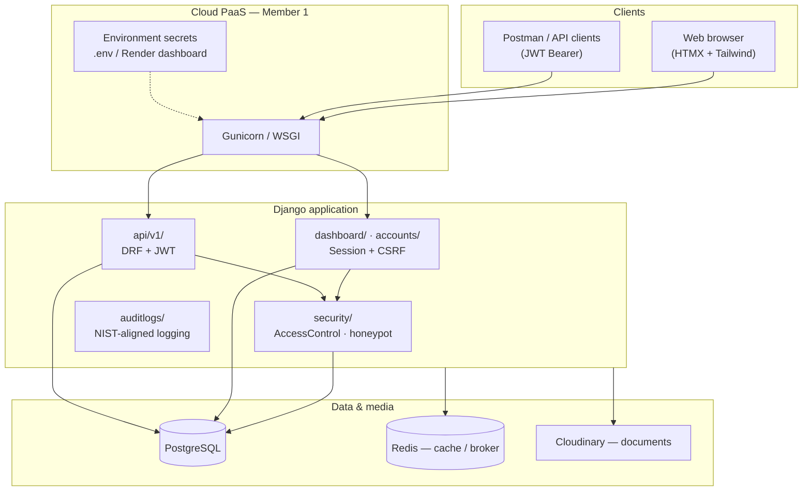

### Application modules (where code lives)

```
config/           Settings, URLs, Celery, production hardening
accounts/         Users, clinics, doctor–patient assignments
patients/         Patient records (UUID)
triage/           Priority scoring
consultations/    Admit, discharge, bulk discharge service
security/         AccessControlService, permissions, honeypot
api/v1/           REST + JWT auth serializers
dashboard/        Role-based HTML views
auditlogs/        Audit trail
core/             Custom template tags (mhtms_tags)
common/           Shared filters, base models
```

---

## 2. Five roles overview

Each member owns a **vertical slice** of the stack. Security is not one person’s job—it is **enforced at every layer**.

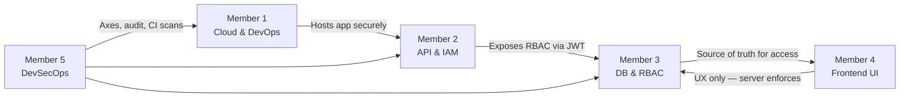

| Member | Title | Primary deliverable | Key security proof |
|--------|--------|---------------------|-------------------|
| **1** | Lead Cloud & DevOps | Live deployment on Render/Railway | Secrets not in Git; HTTPS, HSTS, CSP |
| **2** | API & IAM Engineer | DRF `/api/v1/` + JWT | Masked vs full API by role |
| **3** | Database & RBAC Lead | Models + Anti-IDOR + bulk ops | 403 on another doctor’s patient UUID |
| **4** | Frontend UI Engineer | Templates, filters, formsets | CSRF + filters persist; UI cannot bypass RBAC |
| **5** | DevSecOps & Compliance | Axes, honeypot, audit, CI | Live lockout + clean `check --deploy` |

---

## 3. Security defense in depth

Controls are stacked so that bypassing one layer still leaves others active.

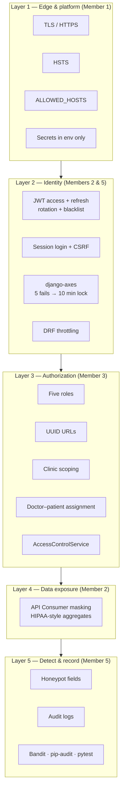

### Role matrix (who can do what)

| Capability | Super Admin | Doctor | Nurse | Receptionist | API Consumer |
|------------|:-----------:|:------:|:-----:|:------------:|:------------:|
| All clinics / staff admin | Yes | No | No | No | No |
| Own clinic patients | Yes | Assigned only | Clinic | Clinic | No direct PHI |
| Triage / consult write | Yes | Yes | Yes | Limited | No |
| Bulk discharge | Yes | Own patients | No | No | No |
| Public masked stats API | Yes | Yes | Yes | Yes | **Yes (masked only)** |

Demo passwords and emails: see [README — Demo Accounts](../README.md#demo-accounts).

---

## 4. Member 1 — Lead Cloud & DevOps Engineer

### Responsibility diagram

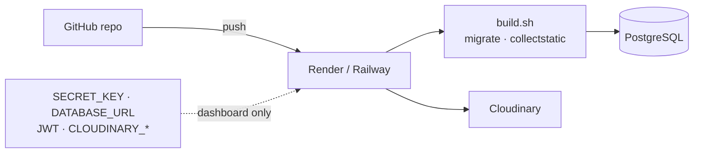

### What you built

| Task | Where in the project |
|------|----------------------|
| PaaS deployment | `render.yaml`, `build.sh`, [DEPLOY_RENDER.md](DEPLOY_RENDER.md) |
| Production settings | `config/settings/production.py` — SSL, HSTS, secure cookies, CSP |
| Environment template | `.env.example` (names only; no real secrets) |
| PostgreSQL | `DATABASE_URL` in production |
| Cloudinary media | `CLOUDINARY_*` variables + storage backend |

### Security controls

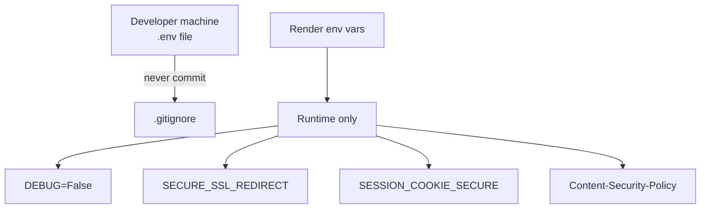

| Control | Setting / file |
|---------|----------------|
| No secrets in repo | `.env` gitignored; use `.env.example` |
| HTTPS only | `SECURE_SSL_REDIRECT`, secure cookies |
| Browser hardening | HSTS, CSP (see `tests/test_production_csp.py`) |
| Deploy validation | `python manage.py check --deploy` in CI |

### Presentation script (~5–7 min)

1. **Open defense** — show live URL and one-sentence purpose of MHTMS.
2. Draw or point to the **architecture diagram** (Section 1).
3. Hosting dashboard → show **variable names**, blur **values**.
4. Run or show CI output: `manage.py check --deploy` passing.
5. Mention `build.sh`: migrations, static files, optional `seed_demo` on Render.

**Closing line:** *“Production runs with DEBUG off, TLS on, and all secrets injected at runtime—not stored in source control.”*

---

## 5. Member 2 — API & IAM Engineer

### API authentication flow

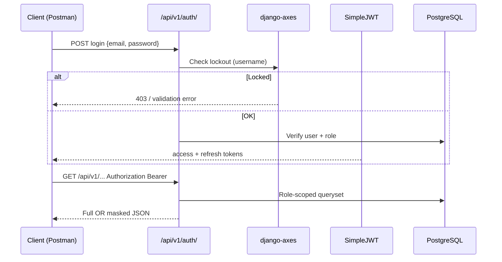

### What you built

| Task | Where in the project |
|------|----------------------|
| REST API v1 | `api/v1/` — patients, consultations, analytics |
| JWT login | `api/v1/auth_serializers.py`, `SIMPLE_JWT` in `config/settings/base.py` |
| Token rotation & blacklist | `ROTATE_REFRESH_TOKENS`, `BLACKLIST_AFTER_ROTATION` |
| Role seeding | `python manage.py seed_demo` |
| Field-level masking | `AnalyticsService.public_masked_stats()`, public health-stats endpoint |
| Postman demos | [docs/postman/MHTMS_API.postman_collection.json](postman/MHTMS_API.postman_collection.json) |

### Masked vs unmasked “twist”

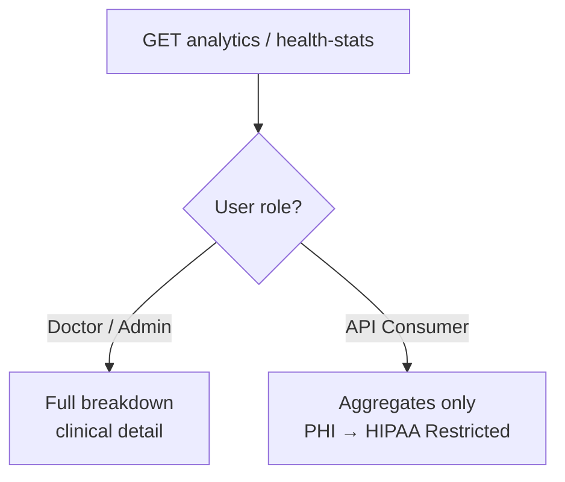

Example public call (from README):

```http
GET /api/v1/public/health-stats/?region=Region+VIII
Authorization: Bearer <api_consumer_token>
```

### Presentation script (~6–8 min)

1. **POST** `/api/v1/auth/login/` as `doctor@mhtms.gov.ph` → copy `access`.
2. Call a protected resource → show **full** patient/analytics fields.
3. **POST** login as API Consumer (seeded role) → same endpoint → show **masked** response.
4. Optional: refresh token once → prove old refresh is **blacklisted**.
5. Reference Swagger: `/api/docs/`.

**Closing line:** *“The API uses JWT with rotation; authorization and masking are enforced in serializers and services, not in the client.”*

---

## 6. Member 3 — Database Architect & RBAC Lead

### Anti-IDOR decision flow

Every access to a patient or consultation should pass through `AccessControlService` in `security/access.py`.

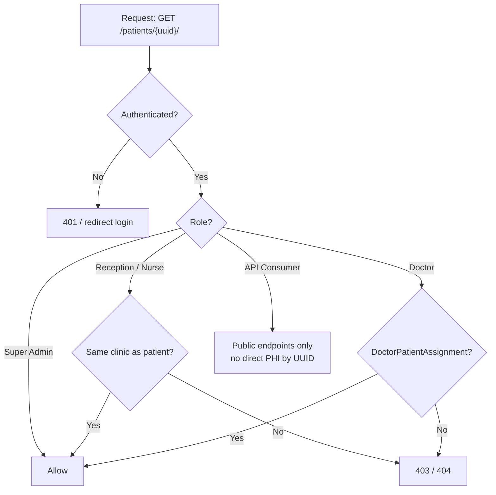

### Mine vs All querysets

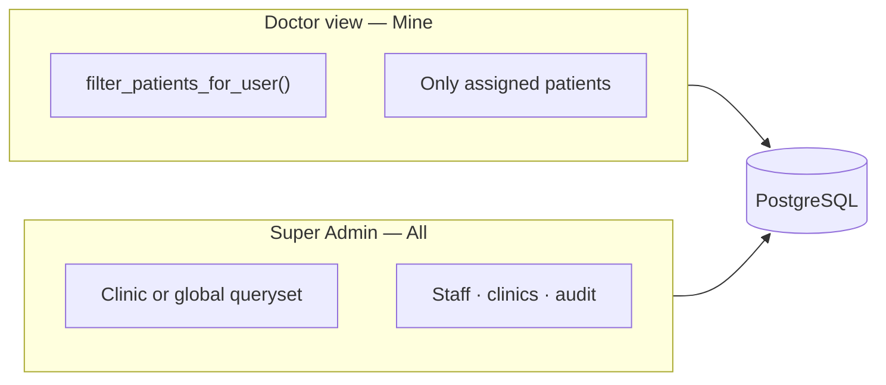

| Pattern | Implementation |
|---------|----------------|
| Filter patients | `AccessControlService.filter_patients_for_user()` |
| Filter consultations | `AccessControlService.filter_consultations_for_user()` |
| Single-object check | `assert_patient_access()` / `can_access_patient()` |
| List filters (session) | `common/list_filters.py` — filters not trusted from URL alone |
| Bulk discharge | `ConsultationService.bulk_discharge()` in `consultations/services.py` |

### Bulk discharge (secure batch)

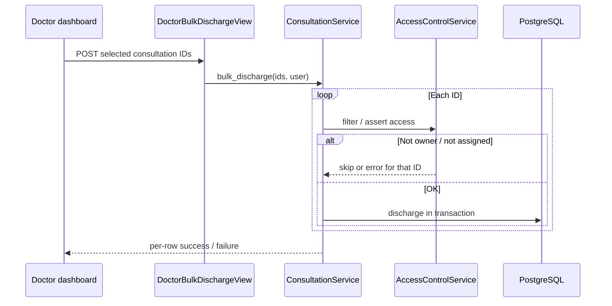

Tests: `tests/test_api_security.py`, `tests/test_bulk_discharge.py`, `tests/test_permissions.py`.

### Presentation script (~6–8 min)

1. Login as **doctor@mhtms.gov.ph** (Carigara) — show patient list (mine only).
2. Copy a **Barugo patient UUID** from seed data or admin — open detail URL → **403**.
3. Login as **admin@mhtms.gov.ph** — same UUID → **success** (legitimate admin access).
4. Select multiple admitted consultations → **bulk discharge** → show partial errors if an ID is forged.
5. Mention **UUID** in URL bar (no integer scraping).

**Closing line:** *“We never trust the URL alone—AccessControlService checks role, clinic, and assignment on every object.”*

---

## 7. Member 4 — Frontend UI & Component Engineer

### UI architecture

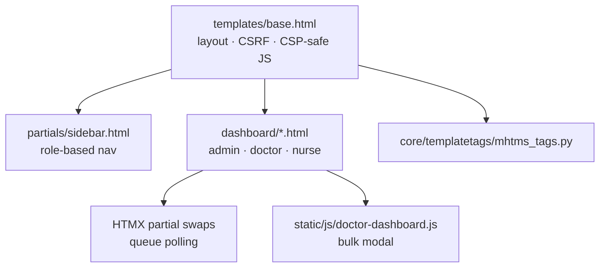

### What you built

| Task | Where in the project |
|------|----------------------|
| Base layout & sidebar | `templates/base.html`, `templates/partials/sidebar.html` |
| Role dashboards | `templates/dashboard/admin.html`, doctor/nurse views |
| Date/status filtering | Dashboard views + session-backed filters |
| Pagination + filters | Querystring/session preserves active filters across pages |
| Bulk discharge UI | Modal in doctor dashboard + `doctor-dashboard.js` |
| Custom tags | `core/templatetags/mhtms_tags.py` |
| Mobile sidebar | CSS `.mobile-sidebar-overlay` + vanilla JS (CSP-safe) |

### Filter persistence (concept)

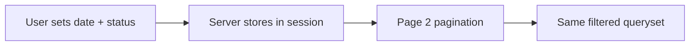

### Security note for the panel

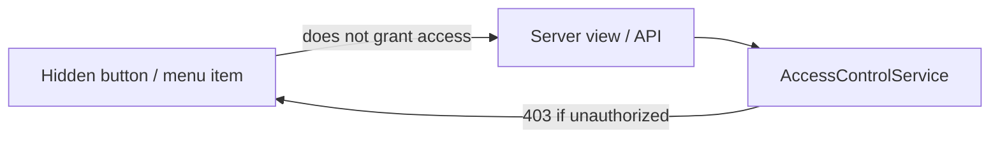

The UI **guides** users; **Member 3’s backend** always enforces permissions. CSRF tokens protect all form POSTs.

### Presentation script (~5–6 min)

1. Walk through **login → dashboard** matching role (doctor queue vs admin cards).
2. Apply **date and status filters** → go to page 2 → filters still applied.
3. Open **bulk discharge** modal → confirm → success/error messages.
4. Show one **custom template tag** usage in a template (``).
5. Optional: resize to mobile — sidebar open/close (no Alpine eval on production CSP).

**Closing line:** *“The interface is role-aware for usability; every POST still requires CSRF and server-side permission checks.”*

---

## 8. Member 5 — DevSecOps & Compliance Analyst

### Active defense stack

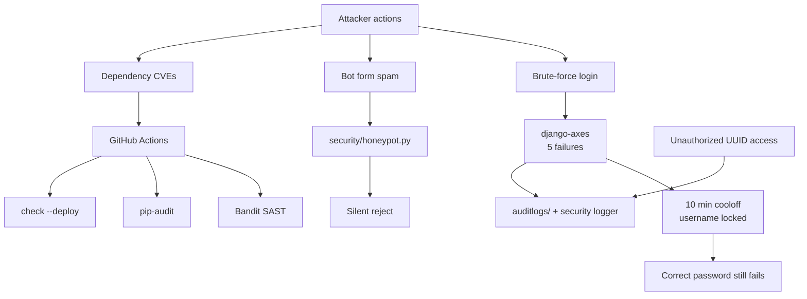

### Login lockout timeline

```
Attempt 1–4 (wrong password)  →  count failures
Attempt 5 (wrong password)    →  account LOCKED (username key)
Attempt 6+ (any password)     →  blocked until cooloff OR unlock_login
After 10 minutes              →  automatic unlock (cooloff elapsed)
```

| Setting | Value | File |
|---------|-------|------|
| `AXES_FAILURE_LIMIT` | 5 | `config/settings/base.py` |
| `AXES_COOLOFF_MINUTES` | 10 | env / settings |
| Lock key | `username` only | prevents IP hopping bypass |
| App-layer guard | `accounts/login_lockout.py`, `LoginForm` | same rules for web + API login |

Unlock for demos:

```bash
python manage.py unlock_login --email=doctor@mhtms.gov.ph
python manage.py unlock_login --all
```

### CI security pipeline

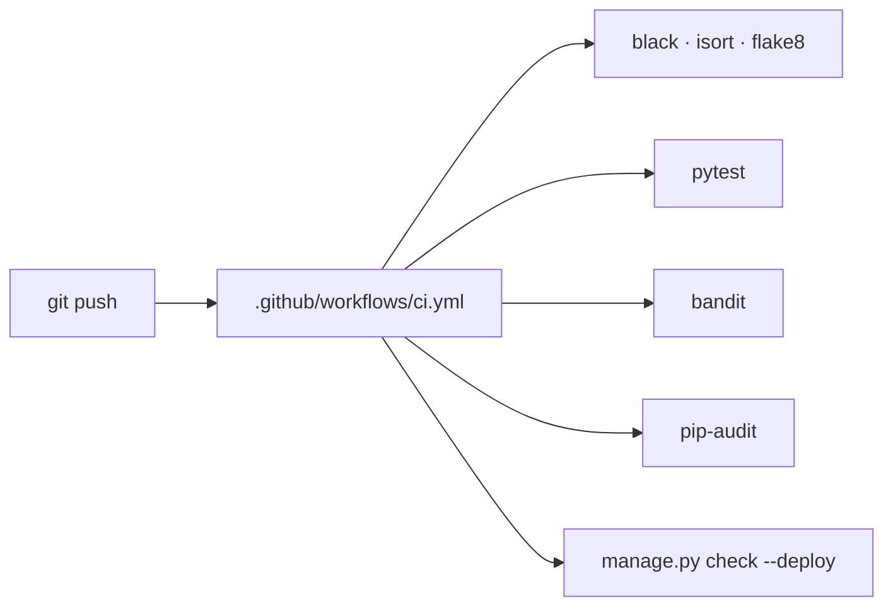

### Presentation script (~6–8 min)

1. **Live brute force** — wrong password ×5 on login page → single lockout message.
2. Enter **correct** password while locked → still denied (coordinate message with Member 2 API if desired).
3. Show **audit log** screen (`templates/dashboard/admin_audit.html`) or Django admin entries.
4. Submit form with **honeypot** field filled → rejection.
5. Screen-share **GitHub Actions** — green security jobs.
6. Show `tests/test_login_lockout.py` passing locally: `pytest tests/test_login_lockout.py -v`.

**Closing line:** *“We assume breach attempts on login and APIs; axes, throttles, honeypots, and audit logs give us block-and-detect without hiding failures.”*

---

## 9. End-to-end request flows

### Web request (session)

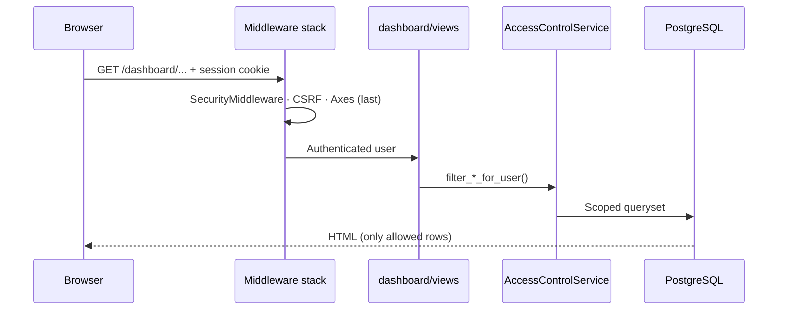

### API request (JWT)

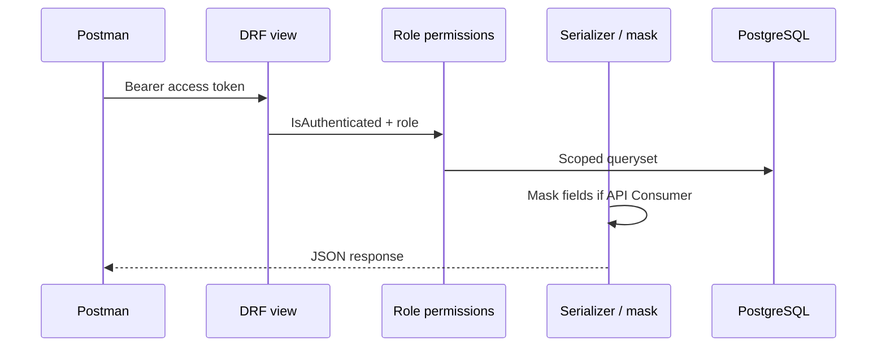

---

## 10. Defense presentation order

```mermaid
gantt
    title Suggested defense flow (~30 min)
    dateFormat X
    axisFormat %M min

    section Opening
    Member 1 Live app + cloud     :0, 7
    section Core demos
    Member 2 Postman JWT + mask   :7, 15
    Member 3 IDOR + bulk          :15, 23
    Member 4 UI filters + forms   :23, 29
    section Closing
    Member 5 Attacks + CI         :29, 36
    section Panel
    Q&A                           :36, 45
```

| Order | Speaker | Time | Must demonstrate |
|:-----:|---------|------|------------------|
| 1 | Member 1 | 5–7 min | Live site, env vars safe, architecture |
| 2 | Member 2 | 6–8 min | JWT + masked vs full API |
| 3 | Member 3 | 6–8 min | IDOR blocked + bulk discharge |
| 4 | Member 4 | 5–6 min | Filters + pagination + bulk UI |
| 5 | Member 5 | 6–8 min | Lockout + audit + CI green |
| — | All | 5–10 min | Panel Q&A |

---

## 11. Pre-defense checklist

### Environment (Member 1 + 5)

- [ ] Production: `DEBUG=False`, `ALLOWED_HOSTS` and `CSRF_TRUSTED_ORIGINS` set
- [ ] `AXES_FAILURE_LIMIT=5`, `AXES_COOLOFF_MINUTES=10` (remove legacy hour-only cooloff vars)
- [ ] `.env` not committed; Render secrets configured
- [ ] `python manage.py check --deploy` passes

### Data & accounts (Member 3)

- [ ] `python manage.py seed_demo` run on demo environment
- [ ] Two doctors in different clinics for IDOR demo (`doctor@mhtms.gov.ph`, `doctor2@mhtms.gov.ph`)
- [ ] At least one admitted consultation for bulk discharge

### API (Member 2)

- [ ] Postman collection imported and tested
- [ ] API Consumer account token ready for masking demo

### UI (Member 4)

- [ ] Hard refresh / cache bust if sidebar or static changed recently
- [ ] Filter + pagination path rehearsed once

### Security demo (Member 5)

- [ ] `unlock_login --all` run before lockout demo (or use throwaway test email)
- [ ] GitHub Actions green on `main`
- [ ] `pytest tests/test_login_lockout.py tests/test_api_security.py -v` passes locally

### Compliance talking points (all members)

- [ ] Demo data is **fictional** — no real PHI
- [ ] Each member can name **one control from another layer** (shows team integration)

---

## Quick reference — file map by member

| Member | Start here |
|--------|------------|
| 1 | `docs/DEPLOY_RENDER.md`, `config/settings/production.py`, `build.sh`, `render.yaml` |
| 2 | `api/v1/`, `api/v1/auth_serializers.py`, `docs/postman/` |
| 3 | `security/access.py`, `consultations/services.py`, `tests/test_api_security.py` |
| 4 | `templates/`, `dashboard/views.py`, `core/templatetags/mhtms_tags.py` |
| 5 | `accounts/login_lockout.py`, `config/settings/base.py` (AXES), `.github/workflows/ci.yml`, `auditlogs/` |

---

*Last updated for MHTMS capstone defense — align env vars with `.env.example` before going live.*
